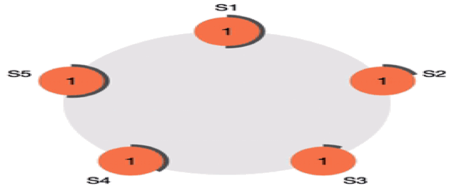

<div id="top"></div>
<!--
*** Thanks for checking out the Best-README-Template. If you have a suggestion
*** that would make this better, please fork the repo and create a pull request
*** or simply open an issue with the tag "enhancement".
*** Don't forget to give the project a star!
*** Thanks again! Now go create something AMAZING! :D
-->


<!-- PROJECT SHIELDS -->
<!--
*** I'm using markdown "reference style" links for readability.
*** Reference links are enclosed in brackets [ ] instead of parentheses ( ).
*** See the bottom of this document for the declaration of the reference variables
*** for contributors-url, forks-url, etc. This is an optional, concise syntax you may use.
*** https://www.markdownguide.org/basic-syntax/#reference-style-links
-->


<!-- PROJECT LOGO -->
<br />
<div align="center">
  <a href="https://github.com/GiovanniBaccichet/RAFT">
    
  </a>

<h3 align="center">The Raft Consensus Algorithm</h3>

  <p align="center">
    A Java implementation using sockets 🗳
    <br />
    <a href="https://raft.github.io/"><strong>Raft Whitepaper »</strong></a>
    <br />
    <br />
    <a href="https://github.com/GiovanniBaccichet/RAFT">Docs 📓</a>
    ·
    <a href="https://github.com/GiovanniBaccichet/RAFT/issues">Report Bug 🪳</a>
    ·
    <a href="https://github.com/GiovanniBaccichet/RAFT/issues">Request Feature ✨</a>
  </p>
</div>


<!-- TABLE OF CONTENTS -->
<details>
  <summary>Table of Contents</summary>
  
- [About The Project 🧬](#about-the-project-)
  - [Built With 🏗](#built-with-)
- [Getting Started](#getting-started)
  - [Prerequisites](#prerequisites)
  - [Installation](#installation)
- [Usage 🔌](#usage-)
- [Roadmap 🛣](#roadmap-)
- [Testing 🧪](#testing-)
  - [Network Partitioning 🔪](#network-partitioning-)
  - [Failure Simulation ⚡️](#failure-simulation-️)
- [Contributing ❤️](#contributing-️)
- [License 📑](#license-)
- [Contact 📬](#contact-)
- [Acknowledgments 🥸](#acknowledgments-)

</details>

<!-- ABOUT THE PROJECT -->
## About The Project 🧬

Raft is a **consensus algorithm** that is designed to be easy to understand. It's **equivalent to Paxos in fault-tolerance and performance**. The difference is that it's decomposed into relatively independent sub-problems, and it cleanly addresses all major pieces needed for practical systems. We hope Raft will make consensus available to a wider audience, and that this wider audience will be able to develop a variety of higher quality consensus-based systems than are available today.

<p align="center">
  
</p>

Consensus is a fundamental problem in fault-tolerant distributed systems. Consensus involves multiple servers agreeing on values. Once they reach a decision on a value, that decision is final. Typical consensus algorithms make progress when any majority of their servers is available; for example, a cluster of 5 servers can continue to operate even if 2 servers fail. If more servers fail, they stop making progress (but will never return an incorrect `stateMachineResult`).

Consensus typically arises in the context of replicated state machines, a general approach to building fault-tolerant systems. Each server has a state machine and a log. The state machine is the component that we want to make fault-tolerant, such as a hash table. It will appear to clients that they are interacting with a single, reliable state machine, even if a minority of the servers in the cluster fail. Each state machine takes as input commands from its log. In our hash table example, the log would include commands like set $x$ to 3. A consensus algorithm is used to agree on the commands in the servers' logs. The consensus algorithm must ensure that if any state machine applies set $x$ to 3 as the $n^{th}$ command, no other state machine will ever apply a different $n^{th}$ command. As a `stateMachineResult`, each state machine processes the same series of commands and thus produces the same series of results and arrives at the same series of states.

<p align="right">(<a href="#top">back to top</a>)</p>


### Built With 🏗

* [Java](https://www.java.com/it/)

<p align="right">(<a href="#top">back to top</a>)</p>


<!-- GETTING STARTED -->
## Getting Started

This is an example of how you may give instructions on setting up your project locally.
To get a local copy up and running follow these simple example steps.

### Prerequisites

**To be added.**

### Installation

**To be added.**

<p align="right">(<a href="#top">back to top</a>)</p>


<!-- USAGE EXAMPLES -->
## Usage 🔌

Use this space to show useful examples of how a project can be used. Additional screenshots, code examples and demos work well in this space. You may also link to more resources.

_For more examples, please refer to the [Documentation](https://raft.github.io/)_

<p align="right">(<a href="#top">back to top</a>)</p>


<!-- ROADMAP -->
## Roadmap 🛣

<details>
  <summary>Java implementation:</summary>

- [ ] Consensus Module
  - [ ] Persistent State Management
  - [ ] Candidate
  - [X] Leader
  - [ ] Follower
- [ ] Vote Handling
- [ ] Client
- [ ] Server
  - [ ] State Machine
- [X] Thread Management
- [X] Log Management
  - [X] Entities
  - [X] Persistence
  - [X] Truncation
  - [X] Snapshots

</details>

<details>
  <summary>Testbed environment:</summary>

- [X] Network Topology
- [X] Vagrant configuration
  - [X] Router
  - [X] Main Switch
  - [X] Sub-Switches
  - [X] Nodes
- [X] Scripts for testing (link failure simulation *et similia*)
  - [X] GUI
  - [X] Adding `tc` rules
  - [X] Deleting `tc` rules
  - [X] Network partition support

</details>

See the [open issues](https://github.com/GiovanniBaccichet/RAFT/issues) for a full list of proposed features (and known issues).

<p align="right">(<a href="#top">back to top</a>)</p>

<!-- TESTING -->
## Testing 🧪

Since the algorithm is <mark>robust against any non-byzantine failure, links can have omissions and delays, processes can stop at any time</mark>. For this reason we decided to deploy 5 hosts and simulate the different behaviors our implementation could have in a controlled environment. The network topology is shown in the diagram below.


[![Network topology - testing the implementation][net-topology]](https://github.com/GiovanniBaccichet/RAFT)

In order to work with a controlled environment, to properly asses the correctness of the implementation, we decided to virtualize the 5 hosts, plus a router and a switch to network them together. The challenge was to test the above mentioned failures:

- **Links** can have **omissions**;
- **Links** can have **delays**;
- **Processes** can **stop** at any time.

The software of choice for creating a suitable lab for testing purposes was **Vagrant** (and **VirtualBox**): both software are open source and offer the required capabilities for handling link failure, as well as process failure. This will be explained more in depth in the following.

```
📁 RAFT
└── 📁 Testing\ Environment/
    ├── 📁 vagrant/
    │   ├── 📁 nodes/
    │   │   ├── 📄 node1.sh
    │   │   ├── 📄 node2.sh
    │   │   ├── 📄 node3.sh
    │   │   ├── 📄 node4.sh
    │   │   └── 📄 node5.sh
    │   ├── 📄 client.sh
    │   ├── 📄 raft-node.sh
    │   ├── 📄 router.sh
    │   └── 📄 switch.sh
    └── 📄 Vagrantfile
```

As shown in the box above, the VMs are creating following what's inside the `Vagrantfile` and configured based on the respective bash scripts contained in `vagrant/`.
Network failure is simulated using [netem](https://wiki.linuxfoundation.org/networking/netem#delay_distribution), a tool that comes built-in Linux. This allows to simulate:
- **Delay**: `tc qdisc change dev eth0 root netem delay 100ms 20ms distribution normal`

- **(Random) Packet Loss**: `tc qdisc change dev eth0 root netem loss 0.1%`

- **Packet Duplication**: `tc qdisc change dev eth0 root netem duplicate 1%`

- **Packet Corruption**: `tc qdisc change dev eth0 root netem corrupt 0.1%`

Another useful feature of netem is the capability to control the bandwidth using the `rate` feature. Another options could have been playing with `iptables`.

The following table binds each VM with the respective IP and subnet:

| Name   | IP         |
|--------|------------|
| Client | `10.0.1.2` |
| Router | `10.0.1.1`, `10.0.0.1`   |
| Switches | -  |
| Node 1 | `10.0.0.11`  |
| Node 2 | `10.0.0.12`  |
| Node 3 | `10.0.0.13`  |
| Node 4 | `10.0.0.14`  |
| Node 5 | `10.0.0.15`  |

Each `node` machine is identical to the other (every one of them is configured by the same bash script, `vagrant/raft-node.sh`).

<p align="right">(<a href="#top">back to top</a>)</p>

### Network Partitioning 🔪

As shown in the above diagram, **network is divided into 2 portions**. This choice was taken in order to allow network partitioning and test the behavior of our Raft algorithm implementation in a particular case: network can fail partially. Moreover, one portion of the network (the orange one) can re-establish consensus, while the remaining part (the blue one) should'n be able to reach *quorum*, since there are only 2 nodes.

The switch layering is managed by the open source tool [**Open vSwitch**](https://www.openvswitch.org/), which allowed us to create 3 virtual bridges, connected together in order to simulate a somehow realistic scenario. The nodes in the green zone of the diagram are virtual switches, and will be used in the *Failure Simulation* (see following section). 

The setup is handled by the `vagrant/switch.sh` script. From that one can really understand what is going on in terms of configuration.

The internal configuration of the above mentioned virtual bridges can be easily visualized in the following diagram.

[![Switch configuration - testing the implementation][switch-config]](https://github.com/GiovanniBaccichet/RAFT)

Three bridges are connected to each other using the `patchN` ports and, as the names suggest, `vSwitchRouter` is connected to the router, `vSwitchPart1` connects the hosts in the upper network partition, while `vSwitchPart2` connects the remaining 3 hosts of the lower network partition.

This configuration adds complexity to the testbed, but allows to test **partition tolerance** of our implementation.


<p align="right">(<a href="#top">back to top</a>)</p>

### Failure Simulation ⚡️

As disclosed above, link failure is handled using the **traffic control** tool (`tc`) that comes built-in Linux. In order to make testing easier we created a script that, running on the host machine and using `vagrant ssh`, can add traffic control rules to the switch's interfaces and, using `netem` simulate the different behaviors listed in the previous section. Moreover, the user can halt VMs and kill processes in order to simulate processes crashing.
Said script is `control-center.sh` and looks like this:

[![control-center.sh screenshot - main menu][control-center]]()

[![control-center.sh screenshot - simulation menu][control-center-simulation]]()

<p align="right">(<a href="#top">back to top</a>)</p>

<!-- CONTRIBUTING -->
## Contributing ❤️

Contributions are what make the open source community such an amazing place to learn, inspire, and create. Any contributions you make are **greatly appreciated**.

If you have a suggestion that would make this better, please fork the repo and create a pull request. You can also simply open an issue with the tag "enhancement".
Don't forget to give the project a star! Thanks again!

1. Fork the Project
2. Create your Feature Branch (`git checkout -b feature/AmazingFeature`)
3. Commit your Changes (`git commit -m 'Add some AmazingFeature'`)
4. Push to the Branch (`git push origin feature/AmazingFeature`)
5. Open a Pull Request

<p align="right">(<a href="#top">back to top</a>)</p>


<!-- LICENSE -->
## License 📑

Distributed under the GPLv3 License. See `LICENSE` for more information.

<p align="right">(<a href="#top">back to top</a>)</p>


<!-- CONTACT -->
## Contact 📬

Giovanni Baccichet - [@Giovanni_Bacci](https://twitter.com/Giovanni_Bacci) - `giovanni.baccichet[at].polimi.it`

Chiara Magri - `chiara1.magri[at]mail.polimi.it`

<p align="right">(<a href="#top">back to top</a>)</p>


<!-- ACKNOWLEDGMENTS -->
## Acknowledgments 🥸

* [The Raft Consensus Algorithm](https://raft.github.io/)
* [Documentation | Vagrant by HashiCorp](https://www.vagrantup.com/docs)
* [The Linux Foundations - netem](https://wiki.linuxfoundation.org/networking/netem#delay_distribution)
* [Open vSwitch](https://www.openvswitch.org/)

<p align="right">(<a href="#top">back to top</a>)</p>


<!-- MARKDOWN LINKS & IMAGES -->
<!-- https://www.markdownguide.org/basic-syntax/#reference-style-links -->

[raft-animation]: media/raft_animation.gif

[uml-class-diagram]: media/uml-class-diagram.jpg

[net-topology]: media/net_topology.png

[switch-config]: media/v_switch-config.png

[control-center]: media/control-center.png

[control-center-simulation]: media/control-center-simulation.png
